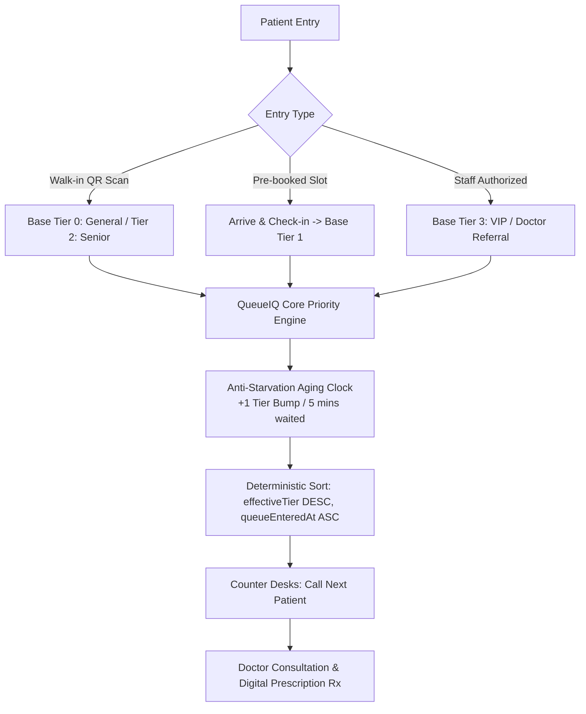

# 🏥 QueueIQ — Smart Appointment & Priority Queue Management System

<p align="center">
  
</p>

<p align="center">
  <strong>A deterministic priority queue scheduling engine for modern healthcare outpatient clinics.</strong><br>
  <em>Unifies pre-booked appointments and unscheduled walk-in demand into one fair, anti-starvation stream.</em>
</p>

<p align="center">
  
  
  
  
  
</p>

---

## 📌 Problem Statement

Hospitals and outpatient clinics deal with two fundamentally conflicting customer streams:
1. **Pre-booked appointment holders** who reserved a future time slot days in advance.
2. **Unscheduled walk-in patients** (general public, senior citizens, triage) who arrive dynamically.

### 🛑 The Traditional Broken Queue Traps
- **The Starvation Trap**: If high-priority walk-ins or senior citizens arrive continuously, an appointment holder who arrived strictly on time gets repeatedly pushed back indefinitely.
- **Zero Transparency**: Patients wait blindly in crowded waiting halls without knowing their real position or wait duration.
- **Staff Overload**: Reception desks are inundated with anxious inquiries about queue status.

---

## 💡 The QueueIQ Solution

QueueIQ resolves this using a **Tiered Priority Engine with Dynamic Anti-Starvation Aging**, inspired by Operating System CPU priority scheduling.



---

## ⚙️ The Priority & Anti-Starvation Engine

### 1. Base Priority Tiers
Every customer is assigned an immutable `baseTier` upon entering the live queue:

| Tier | Category | Assigned By | Priority Description |
|:---:|:---|:---|:---|
| **Tier 3** | **VIP / Doctor-Referred** | Staff only (via dashboard) | Immediate front of queue. Public users can never self-select. |
| **Tier 2** | **Senior Citizen** | Self-declared at walk-in / check-in | Senior care priority over routine general visits. |
| **Tier 1** | **Booked Appointment** | Automatic upon physical check-in | Respects scheduled appointment arrival. |
| **Tier 0** | **General Walk-in** | Default walk-in | Standard arrival tier. |

### 2. Anti-Starvation Aging Formula (`priority.js`)
To prevent lower-tier patients from being starved indefinitely by higher-tier arrivals, every waiting customer gains **+1 tier for every 5 minutes** spent waiting (capped at Tier 3):

$$\text{effectiveTier} = \min\left(3, \; \text{baseTier} + \left\lfloor \frac{\text{minutesWaited}}{5} \right\rfloor \right)$$

$$\text{Sorting Rule} = (\text{effectiveTier} \; \text{DESC}, \; \text{queueEnteredAt} \; \text{ASC})$$

> **Why this solves starvation**: A Tier 0 general walk-in waiting 10 minutes reaches **Tier 2**, matching and overtaking newly arrived senior citizens. No special-case bypass logic is required; a single deterministic sort sequences every patient fairly.

---

## 🚀 Key Feature Highlights

### 📱 1. Patient Care Portal (`customer.html`)
- **7 Responsive Views**: Home, Specialties Directory, Walk-in Registration, Booking Calendar, Booking Confirmation, Check-in Gate, and Live Status Tracker.
- **Live Aging & Telemetry Clock**: Visual progress bar showing remaining seconds until the next priority tier bump.
- **Dynamic Call Alerts**: Mobile screen flashes with desk number when the doctor clicks *Call Next*.
- **Verified Digital Prescription (Rx)**: Once consultation completes, patients view and print their electronic prescription slip directly from their phone.

### 🛡️ 2. Staff Command Dashboard (`staff.html`)
- **PIN-Based Authentication**: Protected access control for attending physicians (`PIN: 1234`) and administrators (`PIN: 9999`).
- **Departmental Counter Desks**: Doctors call the next prioritized patient per department with a single click.
- **VIP Booking Authority**: Strictly staff-privileged Tier 3 booking with clinical justification notes.
- **1-Click Seed & Reset**: Instant demo database population with realistic wait-times for testing.

### 🩺 3. Doctor Consultation & Electronic Rx Slip
- Attending doctors record **Primary Diagnosis**, **Clinical Observations**, and dynamic **Medication Tables** (Drug Name, Dosage, Frequency, Duration).
- Automatically persists to the Firestore `prescriptions` collection and stamps an official Rx document for the patient.

### 🖨️ 4. Reception Scan QR Standee Kiosk
- Client-side dynamic QR generator embedded in the dashboard.
- Ready-to-print **A4 Desk Standee Poster** with step-by-step instructions for patients to scan and enter the queue from their phones.

### 🎬 5. Interactive Animated Presentation Player (`video-presentation.html`)
- Self-contained 16:9 cinematic product explainer web app with auto-play scenes, visual cards, timeline controls, and teleprompter narration.

---

## 📂 Project Architecture

```
saqms-v2/
├── backend/
│   ├── src/
│   │   ├── firestore.js                # Firebase Admin SDK initialization (Local & Cloud Env)
│   │   ├── priority.js                 # 4-Tier Base + Anti-starvation Aging mathematical engine
│   │   ├── server.js                   # Express application entry, static server & middleware
│   │   └── routes/
│   │       ├── auth.js                 # PIN authentication & session verification
│   │       ├── services.js             # Specialty & department CRUD operations
│   │       ├── counters.js             # Counter desk calling engine (uses priority.js)
│   │       ├── tokens.js               # Queue tokens, live ETA status, and Rx completion
│   │       ├── appointments.js         # Future slot booking & arrival check-in
│   │       └── demo.js                 # 1-click realistic demo queue seeder
│   ├── package.json                    # Dependencies & start scripts
│   └── serviceAccountKey.example.json  # Firebase credentials template
├── frontend/
│   ├── customer.html                   # 7-Screen patient mobile care portal
│   ├── customer.js                     # Patient UI, calendar booking, live polling, and Rx viewer
│   ├── staff.html                      # Staff operations center & counter desk manager
│   ├── staff.js                        # Live sync, counter controls, PIN auth, and Rx modal
│   ├── video-presentation.html         # 16:9 animated video player & viva pitch deck
│   ├── qr-kiosk.js                     # Dynamic reception standee QR code generator
│   ├── config.js                       # API base URL resolver (LAN, localhost, Render)
│   ├── index.html                      # Root redirect entrypoint
│   └── styles.css                      # Complete Figma design tokens, modal styles & print layout
├── render.yaml                         # Render Web Service cloud deployment blueprint
├── vercel.json                         # Vercel static routing configuration
├── video_script_and_storyboard.md      # Word-for-word voiceover script and animation cues
├── .gitignore                          # Protects serviceAccountKey.json and node_modules
└── README.md                           # Documentation & Viva presentation guide
```

---

## 🛠️ Local Setup & Installation

### 1. Prerequisites
- **Node.js** (v18 or higher)
- **Firebase Firestore Database** (Test mode enabled)

### 2. Clone & Install
```bash
git clone https://github.com/Coderclash-ceo/QueueIQ.git
cd QueueIQ/backend
npm install
```

### 3. Firebase Credentials Setup
1. Go to **Firebase Console** → Project Settings → Service Accounts.
2. Click **Generate new private key** and download the JSON file.
3. Save the file as `backend/serviceAccountKey.json`.
*(Note: `serviceAccountKey.json` is protected in `.gitignore` and must never be committed publicly).*

### 4. Run the Server
```bash
npm start
# or development with live reload:
npm run dev
```
The application will launch on `http://localhost:4000`:
- **Patient Clinic Portal**: [http://localhost:4000/customer.html](http://localhost:4000/customer.html)
- **Staff Operations Dashboard**: [http://localhost:4000/staff.html](http://localhost:4000/staff.html) *(PIN: `1234`)*
- **Animated Video Presentation**: [http://localhost:4000/video-presentation.html](http://localhost:4000/video-presentation.html)

---

## 🎓 Viva & Technical Defense Guide

### 🎤 What to say when asked: *"What exactly did you build?"*
> *"We built **QueueIQ**, an intelligent queue scheduling engine that reconciles pre-booked appointments and unscheduled walk-in demand into a single deterministic priority queue. Borrowing the concept of **Priority Scheduling and Anti-Starvation Aging from Operating Systems**, it gives genuine priority to scheduled slots, seniors, and VIPs, while mathematically guaranteeing that no waiting patient can be starved indefinitely."*

---

### 🧪 Suggested 5-Step Demo Script for Viva

1. **Initialize Services & Desks**:
   - Open `staff.html` (enter PIN `1234`).
   - Confirm default departments exist (*General OPD, Pediatrics, Cardiology*).
   - Ensure *Counter 1* is active for *General OPD*.

2. **Demonstrate Base Priority**:
   - In a new incognito window, open `customer.html` and join walk-in as **"Patient 1 (General Walk-in)"** &rarr; Position #1.
   - Join as a second walk-in **"Patient 2 (Senior Citizen)"** &rarr; Observe Patient 2 immediately jumps to **Position #1** ahead of Patient 1 due to Base Tier 2 vs Tier 0.

3. **Demonstrate VIP Staff Privilege**:
   - On `staff.html`, book a **VIP Slot** for *"now"*, note the ID, and check in via `customer.html` check-in tab.
   - Watch the VIP token jump to the absolute head of the queue (Tier 3).

4. **Demonstrate the Starvation Fix**:
   - Explain the Aging formula:
     $$\text{effectiveTier} = \min(3, \; \text{baseTier} + \lfloor \text{wait} / 5 \rfloor)$$
   - Show how Patient 1's live countdown on their phone will bump their effective tier every 5 minutes, eventually matching and overtaking newer arrivals.

5. **Complete the Loop with Rx**:
   - Click **"📢 Call Next"** on Counter 1.
   - Click **"🩺 Rx & Notes"**, fill in diagnosis (*Acute Bronchitis*) and medications.
   - Click **"Save Rx & Complete"**.
   - Show how the patient's phone instantly reveals the **"📄 View & Download Digital Prescription"** button with full verified clinical slip.

---

## ☁️ Deployment

- **Backend Web Service**: Deploy to **Render** (`render.yaml` included). Provide your Firebase Service Account JSON via the `FIREBASE_SERVICE_ACCOUNT_KEY` environment variable.
- **Frontend Static App**: Deploy to **Vercel** (`vercel.json` included). Point `config.js` to your live Render backend URL.

---

## 📜 License
Distributed under the MIT License. Developed for academic and clinical research purposes.
